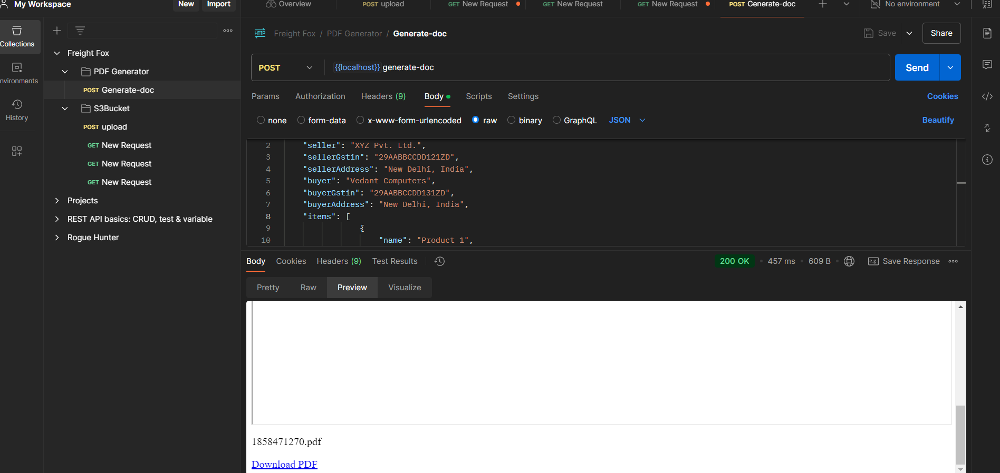
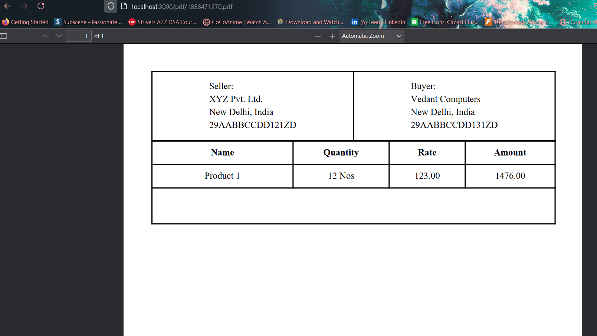
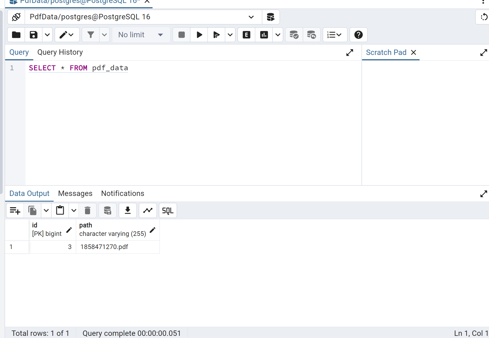

# PDF Generation Service

## Overview

This Spring Boot application provides REST APIs to generate PDF documents based on provided data. It utilizes a Java template engine to create the PDF content dynamically. The application also allows users to download the generated PDFs and stores them locally to avoid regenerating the same PDF for identical data.

## Features

- Generate PDF documents from JSON data.
- Download generated PDFs.
- Store PDFs locally and retrieve them if the same data is provided again.

## Technologies Used

- Spring Boot
- Java
- Java Template Engine (e.g., Thymeleaf)
- iText Library for PDF Manipulation
- Maven
- RESTful APIs

## Screenshots
 
 - This will consume Json data and return a thymeleaf page containing iframe to show the generated PDF
and a download button.
- Cannot be tested in Postman since it does not support embed (iframe) and downloading files. I tested youtube
embed link as well. That too didn't show up in iframe.

- This API is internally used in iframe to display the generated PDF. Works perfectly with browser. Tested on Mozilla.
- A separat API is used to download the generated PDF. Works perfectly with browser. Tested on Mozilla.

- PDF hash is stored in DB for faster retrieval if already present, instead of generating a new PDF again. Hash is created
using the Class which holds the strucure of the received json data.
