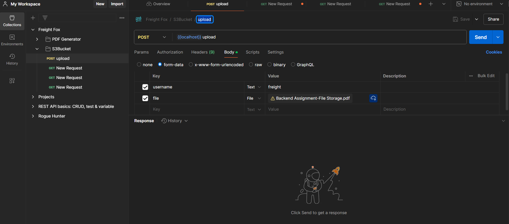
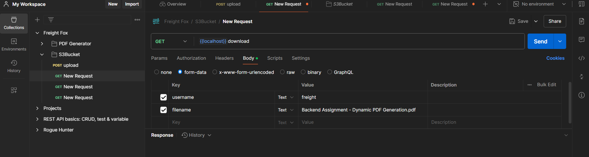

# S3 File Storage Service

## Overview

This Spring Boot application provides REST APIs for managing files stored in an Amazon S3 bucket. Users can upload files, search for files in their directory, and download files from their storage account.

## Features

- Upload files to an S3 bucket.
- Search for files based on a user/filename.
- Download files from the S3 bucket.

## Technologies Used

- Spring Boot
- Amazon S3
- Java
- Maven
- RESTful APIs

## Screenshots

- Testable on Postman. You need to pass username and file to create a folder in S3 bukcet and then upload the file.
- The multipart file is converted to file prior to upload for scaling purposes.

- Folder is created with username and file is stored inside it.

- File is stored in the folder.

- First the username/filename prefix is searched in the bucket and if present, we download the file else return file not found.
- Since everything in s3 is an object, so to imitate the folder like behaviour the username and filename are concatenated with file path separator and then that exact phrase is searched as prefix.